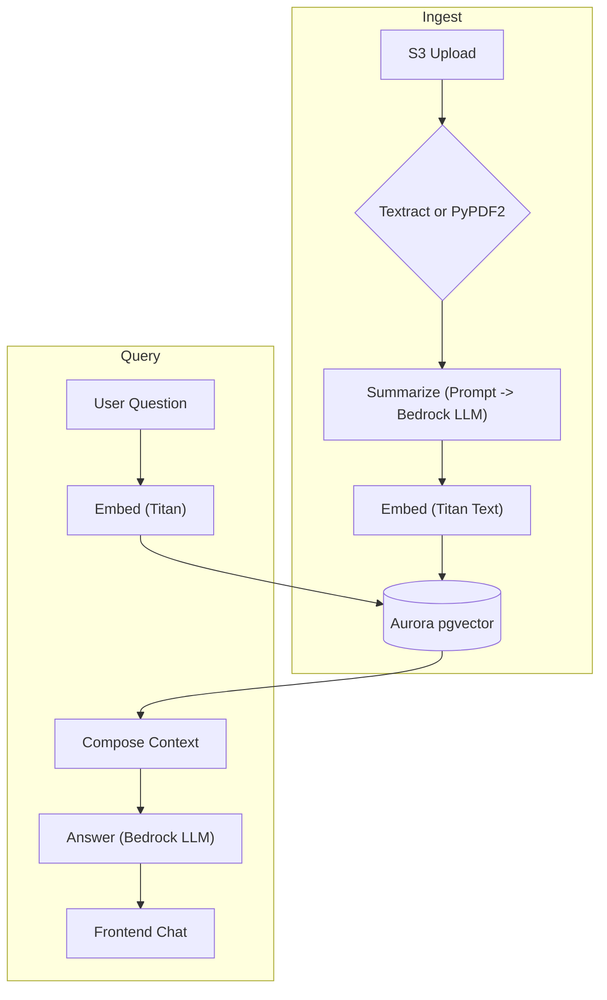

# Academic AI Agent + RAG ("academic-agent-rag")

A full-stack, serverless application for uploading, indexing, and conversing with academic papers. Built for cost-efficiency on AWS, the project couples a Retrieval-Augmented Generation (RAG) backend with a modern React web client.

<p align="center">
  <a href="LICENSE"></a>
  
  
</p>

---

## Table of Contents

1. [Features](#features)
2. [High-Level Architecture](#high-level-architecture)
3. [Tech Stack](#tech-stack)
4. [Orchestration & MCP Extensions](#orchestration--mcp-extensions)
5. [Planner/Verifier Loops](#plannerverifier-loops)
6. [Memory & Context Strategy](#memory--context-strategy)
7. [Framework Integrations (LangChain/LangGraph/CrewAI/AutoGen)](#framework-integrations-langchainlanggraphcrewaiautogen)
8. [Getting Started](#getting-started)
9. [Repository Layout](#repository-layout)
10. [Configuration](#configuration)
11. [CI / CD](#ci--cd)
12. [Testing](#testing)
13. [Cost Guardrails](#cost-guardrails)
14. [Security & Compliance](#security--compliance)
15. [Roadmap](#roadmap)
16. [Contributing](#contributing)
17. [License](#license)

---

## Features

| Category | Details |
|----------|---------|
| **Paper ingest** | Upload PDFs via drag-and-drop; automatic text extraction (Textract / PyPDF2) |
| **Search & QA** | Hybrid metadata + vector search (pgvector); Titan embeddings; Claude/Command-R answer synthesis |
| **Web UI** | Next.js 14 (App Router), Tailwind CSS, dark-mode |
| **Internet discovery** | Lambda crawler for arXiv / Semantic Scholar; one-click import into your corpus |
| **Multi-tenant** | Amazon Cognito auth; per-user S3 prefixes and row-level security |
| **Serverless cost model** | Aurora Serverless v2, API Gateway + Lambda, Step Functions Express |
| **DevEx** | CDK IaC, Docker Compose mocks, pre-commit linting, GitHub Actions |

---

## High-Level Architecture



---

## Tech Stack

| Layer | Technology | Reasoning |
|-------|-------------------------------------------------------------------|-----------|
| **Frontend** | Next.js 14, React 18, Tailwind CSS | Static hosting, fast DX |
| **Auth** | Amazon Cognito OAuth2 | Managed user pools, MFA |
| **API** | API Gateway REST / Lambda (Python 3.11) | Pay-per-ms, easy rollbacks |
| **Workflow** | AWS Step Functions Express | Event-driven pipeline |
| **Storage** | S3, Aurora PostgreSQL v2 + pgvector | Cheap, scales to 15 M docs |
| **Vector Search** | pgvector ivfflat index; optional OpenSearch | Start cheap, upgrade later |
| **LLM & Embeddings** | Amazon Bedrock (Claude Haiku or Command R; Titan Text Embeddings) | On-demand token billing |
| **IaC & CI** | AWS CDK v2 (TypeScript), GitHub Actions | Unified infra-app repo |

---

## Orchestration & MCP Extensions

This project supports tool-based agentic workflows via the Model Context Protocol (MCP) and an orchestration layer that preserves the original AWS-native design. MCP exposes tools (capabilities) to LLMs in a standard way, enabling safe, audited execution of actions like search, retrieval, and ingest.

- **Baseline orchestration**: AWS Step Functions Express continues to drive ingest and long-running jobs.
- **Interactive orchestration (chat)**: The chat Lambda can invoke MCP tools to perform retrieval, browsing, citation fetching, and enrichment.
- **Tool providers**: Tools are hosted as server-side capabilities (Node/Python) and registered with the agent runtime. Each tool is namespaced, typed, and guarded by IAM and an allowlist.

Optional orchestration frameworks (behind flags) can be layered on top without changing core APIs:

- **LangGraph**: Deterministic graph execution for planner/worker/verifier nodes.
- **CrewAI**: Multi-agent roles (Researcher, Critic) across MCP tools.
- **AutoGen**: Conversational agents that negotiate plans, calling MCP tools as needed.
- **LangChain**: Chains and Runnables wrapping the same tool endpoints for quick composition.

> Design principle: keep AWS primitives (S3, Step Functions, Lambdas, Aurora) as the source of truth; orchestration frameworks are adapters that call into the same tool and data layers.

### MCP Tooling Surface

| Tool | Purpose | Backing Service |
|------|---------|-----------------|
| `rag.search` | Hybrid pgvector + metadata search | Aurora + pgvector |
| `rag.citations` | Fetch top-k citations with spans | Aurora + S3 |
| `ingest.extract` | Parse PDF via Textract/PyPDF2 | Textract, Lambda |
| `ingest.embed` | Batch embed text | Bedrock Titan |
| `web.arxiv` | Discover papers by query/id | arXiv API |
| `web.semantic_scholar` | Enrich metadata | Semantic Scholar API |

Each tool declares inputs/outputs (JSON schema), side effects, and cost hints. The agent runtime applies a policy: allowlist, rate limits, timeouts, and content guardrails.

---

## Planner/Verifier Loops

Agentic reasoning is implemented as explicit, inspectable loops; no raw chain-of-thought is stored.

1. **Plan**: Given a user query, produce a structured plan (steps calling `rag.search`, `rag.citations`, optional `web.*`).
2. **Execute**: Call MCP tools per step, collecting artifacts (contexts, citations, snippets).
3. **Verify**: A verifier prompt checks grounding against retrieved contexts and flags hallucinations.
4. **Refine**: If verification fails, request missing context and rerun specific steps (bounded retries).
5. **Respond**: Compose a final answer with citations and grounding markers.

Implementations:

- **AWS-native**: Step Functions Express for long-running plans; Lambda for short interactions.
- **LangGraph**: Nodes for `plan -> execute -> verify -> refine -> respond` with conditional edges.
- **CrewAI/AutoGen**: Assign a Researcher (execute) and Critic (verify) with shared memory.

Configuration flags enable or disable these loops per environment (see `PLANNER_*` vars below).

---

## Memory & Context Strategy

The system separates durable knowledge (RAG index) from ephemeral conversation memory.

- **RAG store**: Aurora Postgres + pgvector stores chunk embeddings, metadata, and citation spans. Immutable by default, updated only on re-ingest.
- **Ephemeral chat memory**: Short-term dialog state stored in Aurora tables with TTL and per-user scoping. Summarized periodically to reduce token usage.
- **Context assembly**: For each question, we fetch top-k chunks, deduplicate by paper, and build a context window with citations. A compact conversation summary is included (not raw CoT).
- **Cache**: Query-result cache keyed by normalized question + user corpus; TTL tuned by stage.

Privacy: per-user row-level security and per-tenant S3 prefixes ensure isolation. No raw chain-of-thought is persisted.

---

## Framework Integrations (LangChain/LangGraph/CrewAI/AutoGen)

These frameworks are optional adapters over the same tool/data surfaces.

- **LangChain**: Use Runnables to wrap `rag.search` and `rag.citations` and compose with Bedrock LLM calls.
- **LangGraph**: Define a small DAG for plan/verify loops; state is a typed dict containing plan, artifacts, and verdicts.
- **CrewAI**: Two-agent crew (Researcher, Critic) share the MCP tools; Critic blocks responses that lack grounding.
- **AutoGen**: UserProxy <-> Assistant pairing, where Assistant can call MCP tools during negotiation.

> All adapters are off by default. Enable via `EXPERIMENTAL_AGENT_FRAMEWORK` and deploy adapter Lambdas where provided.

---

## Getting Started

### 1 – Prerequisites

| Tool | Version | Notes |
|------|---------|-------|
| Node.js | ≥ 18 LTS | `n` or `asdf` recommended |
| Python | 3.12 | Managed by `pyenv` or `asdf` |
| Poetry | ≥ 1.7 | Python dependency mgmt |
| AWS CLI | ≥ 2.13 | Auth via SSO / profiles |
| AWS CDK | v2 globally | `npm i -g aws-cdk@2` |
| Docker Desktop | latest | Local mocks |

### 2 – Bootstrap

```bash
git clone https://github.com/your-org/academic-agent-rag.git
cd academic-agent-rag
make bootstrap         # installs Node, Poetry, CDK into a dev container
cp .env.example .env   # fill in AWS profile, region, stage
```

### 3 – Local Development

```bash
make dev               # docker-compose + localstack + pgvector
open http://localhost:3000
```

Hot-reloads for both Next.js (`pnpm dev`) and Lambdas (`sam local start-lambda`).

Optional MCP toolserver (local):

```bash
make tools.up          # starts local MCP tool providers (if configured)
```

### 4 – Deploy to AWS (dev stage)

```bash
export AWS_PROFILE=dev-sandbox
make deploy STAGE=dev
# CDK synthesises & deploys all stacks
```

### 5 – Destroy

```bash
make nuke STAGE=dev    # cdk destroy --all
```

---

## Repository Layout

| Path | Description |
|------|-------------|
| `/infrastructure` | AWS CDK app – one stack per domain (data, api, ingest…) |
| `/packages/frontend` | Next.js client (TypeScript, React Query, Auth helpers) |
| `/packages/lambdas` | Python Lambda handlers (chat, ingest trigger, crawler…) |
| `/packages/shared-python` | Re-usable Bedrock & pgvector helpers (Poetry package) |
| `/packages/stepfunctions` | ASL definitions for workflows (.asl.json) |
| `/packages/tools` | Optional MCP tool providers (Node/Python) |
| `/tests` | Unit, integration (localstack), load (Artillery) |
| `/scripts` | One-off utilities (DB seeding, data migration) |
| `.github/workflows` | CI, CD, nightly e2e pipelines |
| `docker-compose.dev.yml` | Local mocks: LocalStack, Postgres + pgvector, MinIO |

---

## Configuration

All runtime settings are 12-factor environment variables.

| Variable | Purpose | Example |
|----------|---------|---------|
| `STAGE` | dev \| prod | `dev` |
| `AWS_REGION` | AWS region | `us-east-1` |
| `UPLOAD_BUCKET` | S3 bucket for PDFs | `academic-dev-uploads` |
| `DB_SECRET_NAME` | RDS Secrets Manager name | `academic/dev/aurora` |
| `BEDROCK_MODEL_ID` | Claude, Command R, etc. | `anthropic.claude-3-haiku-20240229-v1:0` |
| `EMBEDDING_MODEL_ID` | Titan Text Embeddings | `amazon.titan-embed-text-v1` |
| `PLANNER_ENABLED` | Enable plan/execute/verify loops | `true` |
| `PLANNER_MAX_RETRIES` | Verification-driven retries | `1` |
| `EXPERIMENTAL_AGENT_FRAMEWORK` | `none` \| `langgraph` \| `crewai` \| `autogen` | `none` |
| `MCP_TOOLS_ENABLED` | Enable MCP toolserver | `true` |
| `MCP_TOOL_ALLOWLIST` | Comma-separated tool ids | `rag.search,rag.citations` |

Local `.env` is never committed; `cdk.json` injects sane defaults during synth for dev use.

---

## CI / CD

| Stage | Workflow | Highlights |
|-------|----------|------------|
| **Lint & Type-Check** | `ci.yml` | Ruff, Black – Python; ESLint, `tsc` – TS |
| **Unit Tests** | `ci.yml` | PyTest; Jest (frontend) |
| **Synth & Diff** | `ci.yml` | Fails if CDK diff not empty / unapproved |
| **Dev Deploy** | `deploy-dev.yml` | Auto on push to main; CDK deploy to dev account |
| **Nightly E2E** | `e2e-nightly.yml` | Cypress vs. live stack; Artillery load run |

---

## Testing

```bash
poetry run pytest tests/unit
pytest tests/integration -m "localstack"
npm run test:frontend   # Jest + React Testing Library
artillery run tests/load/chat-10rps.yml
```

---

## Cost Guardrails

- **Aurora v1 auto-pause** to 0 ACU on idle.
- **Bedrock batch embeddings** (≈ 50% cheaper).
- **Lambda concurrency ceilings** via CDK `reservedConcurrentExecutions`.
- **AWS Budgets** alarm → Slack / SNS (see `observability-stack.ts`).
- **MCP tool budgets**: per-tool rate limits and timeouts; disable costly tools in `prod`.

Starter footprint ≈ **$30 USD / mo** for a research group (<1k papers, 1k QPS burst).

---

## Security & Compliance

- Amazon Cognito MFA, OAuth2 PKCE flow
- S3 & RDS encryption (SSE-KMS) + VPC endpoints
- IAM least privilege (principle of least access in CDK)
- Bedrock Guardrails + content moderation
- GDPR/FERPA ready: per-user hard delete & audit trail (CloudTrail)
- MCP tool allowlists, confirmation prompts, and audit logs (tool id, args, actor)

---

## Roadmap

- [ ] **UI** – citations-view + inline PDF reader
- [ ] **OpenSearch** – switch at 10 M vectors or heavy similarity load
- [ ] **Fine-tune** open-source LLM via SageMaker JumpStart
- [ ] **Plugin API** – export REST hooks for custom ingest enrichers
- [ ] **Notebook** – JupyterLab federated extension for programmatic access
- [ ] **Agent adapters** – ship opt-in LangGraph/CrewAI/AutoGen Lambdas
- [ ] **MCP** – default tool pack (rag.search, citations, arxiv, s2) with per-stage budgets

---

## Contributing

1. Fork & clone the repo
2. `make bootstrap`
3. Create a feature branch (`feat/<slug>`)
4. Commit with Conventional Commits (`git cz`)
5. Open a pull request – CI must pass & at least one review required

Please read `CONTRIBUTING.md` for full guidelines.

---

## License

This project is licensed under the **MIT License** – see [LICENSE](LICENSE) for details.


